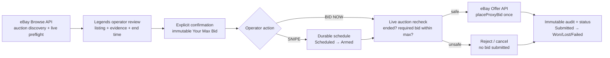

# eBay Offer API Access Package

Status: approved internal review package; not submitted to eBay.

Production bidding remains disabled. Do not change OAuth scopes, call a bidding endpoint, use legacy `PlaceOffer`, or use browser automation unless eBay grants Offer API production access and a separate production-readiness review is approved.

## Business use case

Legends OS is a private operator workspace for reviewing sports-card auctions and placing buyer-authorized bids. It uses Browse API for auction discovery, presents valuation evidence and a recommended maximum, and requires the authenticated operator to enter or confirm **Your Max Bid**. It supports an explicitly confirmed immediate proxy-bid workflow and an explicitly confirmed operator-scheduled workflow. It does not autonomously convert valuations into bids, resell API access, or collect eBay passwords.

## Architecture and data flow

The Offer API supplies the proxy-bid operation; it does not supply native scheduling. Legends owns scheduling, cancellation, locking, preflight, and audit behavior.

## Bid Now workflow

1. The operator enters **Your Max Bid** and reviews the item, current price, bid count, end time, and recommended maximum.
2. Legends presents an explicit confirmation containing the item and exact maximum.
3. Browse API refreshes the live auction immediately before submission.
4. Legends rejects ended auctions, incompatible listing changes, unavailable required-bid data, or a required bid above Your Max Bid.
5. Legends calls `POST /buy/offer/v1_beta/bidding/{item_id}/place_proxy_bid` once with exactly Your Max Bid.
6. The provider response, actual submission time, and subsequent outcome are audited.

## Scheduled Snipe workflow

1. The operator enters Your Max Bid and an offset in seconds; Legends displays the calculated submission time.
2. Explicit confirmation creates a durable `Scheduled` intent.
3. The operator may cancel before submission begins.
4. At the due time, one worker atomically transitions the intent from `Scheduled` to `Armed`.
5. The same live Browse preflight used by Bid Now runs immediately before submission.
6. If safe, `placeProxyBid` is invoked once; otherwise the intent fails closed.
7. Requested, scheduled, actual, auction-end, provider-result, and final-status data are retained.

## Operator control and maximum safeguards

- A valuation never authorizes a bid.
- Recommended Max Bid is advisory and distinct from Your Max Bid.
- Bid Now and Snipe require explicit operator confirmation.
- Editing the maximum invalidates the earlier confirmation.
- Missing, invalid, zero, stale, or exceeded maximums fail closed.
- No submission may exceed Your Max Bid and no retry may raise it.
- Auction state and required bid are rechecked immediately before submission.
- Ended auctions and required bids above the maximum are rejected.

## Duplicate and terminal-state protection

- Every confirmed intent has an immutable idempotency key.
- Database uniqueness permits only one active execution per intent.
- State changes use atomic compare-and-set transitions.
- Worker retries reuse the same execution record.
- Ambiguous provider responses are reconciled before any retry.
- `Submitted`, `Won`, `Lost`, and `Cancelled` records cannot be resubmitted.

## Audit logging

Record the operator/buyer authorization identity, eBay item identifier, action mode, confirmation and request times, maximum and currency, snipe offset, auction end, calculated and actual submission times, preflight state, API endpoint/result/error identifiers, every status transition, cancellation attribution, and final outcome. Never place OAuth credentials or token values in audit output.

## Sandbox demonstration

Provide separate sandbox buyer and seller accounts and demonstrate auction creation/discovery, buyer OAuth consent, successful Bid Now, successful scheduled submission, cancellation, ended-auction rejection, required-bid-above-maximum rejection, duplicate-worker protection, transient-error handling, terminal status presentation, and complete credential-safe auditing. Supply reviewer instructions, screenshots or a short walkthrough, architecture/data flow, and test access details.

## Application and scopes requiring approval

- Existing Legends OS Production keyset, identified securely in eBay Developer MyAccount by its Production Client ID.
- Offer API `v1_beta`.
- User OAuth scope `https://api.ebay.com/oauth/api_scope/buy.offer.auction`.
- `GET /buy/offer/v1_beta/bidding/{item_id}`.
- `POST /buy/offer/v1_beta/bidding/{item_id}/place_proxy_bid`.
- Continued Browse API v1 access for discovery and pre-submission validation.

The current Production keyset returned `invalid_scope` for the auction-offer scope. After eBay grants access, the buyer must complete a new authorization-code consent flow containing that scope.

## Estimated API call volumes

These are conservative Application Growth Check planning estimates, not measured production traffic. Assumptions: one operator, approximately 100–200 reviewed auctions per day, up to 40 confirmed bids per day, and a peak cluster of 15 submissions in one hour. Legends will not poll every displayed listing.

| API operation | Estimated peak/hour | Estimated/day | Basis |
| --- | ---: | ---: | --- |
| Browse search/get-item | 60 | 250 | Paginated collection and health checks, operator refreshes, plus one mandatory live preflight per confirmed bid |
| Offer bidding-status `GET` | 45 | 160 | Initial submission reconciliation and bounded outcome checks; approximately four checks per submitted bid |
| Offer `placeProxyBid` | 15 | 40 | One call per explicitly confirmed Bid Now or armed Snipe intent |

Retries are excluded from normal estimates. Only transient infrastructure failures receive bounded retries, and idempotency/reconciliation runs before a repeated write. These estimates must be revised with measured sandbox traffic before submission.

## Access-request steps

1. Confirm Developer account contacts, Production keyset, OAuth redirect, privacy policy, account-deletion notification compliance, and Developer Account Support access.
2. Complete the reviewable sandbox demonstration and prepare its walkthrough, test credentials, diagrams, security/error policies, and call-volume estimates.
3. Complete the eBay Partner Network and Buy API business-use application when required, including mocks and data flows.
4. After business approval, open an eBay Developer Support ticket titled `Buy API Production Access (<eBay user ID>)`.
5. Identify the Production keyset securely and request Offer API `v1_beta`, `buy.offer.auction`, bidding-status, and `placeProxyBid` access for the documented workflows.
6. Attach the business approval and detailed sandbox review instructions.
7. Complete eBay's compliance review, requested changes, and contracts.
8. Submit the Application Growth Check with the measured/updated hourly and daily endpoint volumes.
9. Only after written enablement, add the scope to the OAuth consent request and reauthorize the buyer account.
10. Keep all production bid execution disabled until a separate Legends OS production-readiness approval is completed.
